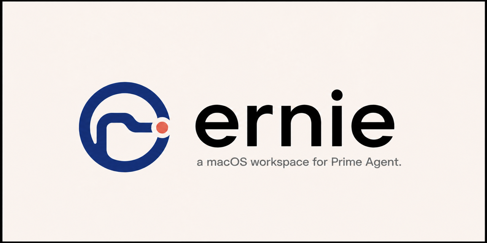

<p align="center">
  
</p>

# Ernie

Ernie is an experimental macOS workspace for Prime Agent. It places durable
sessions beside their repositories and Git worktrees. Prime Agent, not Ernie,
runs models and stores session history.

Ernie is also a small learning lab for the interface around an agent runtime.
[The best software is yet to be made](https://ta-0.com/blog/the-best-software-is-yet-to-be-made)
explains the interface research behind it.

## What Ernie does

- Shows durable conversations, tool activity, queued work, and child Agents.
- Reads and updates sessions through Prime Agent instead of storing a competing copy.
- Hosts trusted built-in plugins, including the Browser plugin.
- Exposes typed controls for window focus, light or dark theme, and sidebar state.

Ernie does not run models. Its Electron main process talks to Prime Agent
through the Prime Agent daemon.

```text
renderer -> Electron IPC -> Ernie daemon -> Prime Agent adapter -> daemon socket
```

## What Ernie can change

- Adding or removing a repository changes Ernie's navigation, not files on disk.
- Git actions can initialize a repository, switch or rename a local branch,
  delete a merged local branch, and create or reuse a sibling worktree. These
  actions call local Git and can change the checkout on disk.
- Session controls send typed requests to Prime Agent. They can change the
  session name, model, thinking level, RLM depth, and submitted tasks when Prime
  Agent accepts the request.
- The CLI and hosted `ernie_ui` tool can focus the window, select a light or dark
  theme, and change sidebar visibility or width. They cannot read or change Git,
  transcripts, or Prime Agent sessions.
- Plugin settings apply only to trusted plugins bundled with Ernie. v0.1.0 does
  not download or run third-party plugins.

## Run Ernie locally

The v0.1.0 development path targets macOS and uses Nub `0.7.5` as its package
runner.

This checkout also uses a local Agentation dependency. Before installing,
make sure its `file:` path in `package.json` points to your Agentation package.

```sh
nub install
nub run dev
```

The development command builds the Electron main process and renderer, starts
Vite on loopback port `5173`, and opens the development application. Stop the
command with `Control+C`.

Run the complete local verification suite before committing a change:

```sh
nub run check
```

Build the Electron main process and renderer without starting Ernie:

```sh
nub run build
```

Build the Apple silicon release application and archive:

```sh
nub run package:mac
```

The archive and SHA-256 checksum appear in `.build/release/`. Local packages
use ad hoc signing. See [Release Ernie for macOS](docs/releases.md) for the
Developer ID, notarization, and GitHub release flow.

## Use the CLI

The repository command builds the CLI before each invocation:

```sh
nub run cli -- --help
nub run cli -- ui capabilities
nub run cli -- ui focus
```

Ernie must be running for capability discovery and UI-changing commands. Help
works without a running application.

See [Use the Ernie CLI](docs/ui-control.md) for every command, exit codes, and
shell-automation behavior.

## Read the documentation

- [Website documentation](https://ernie.ta-0.com/docs/) covers setup, architecture,
  CLI control, plugins, releases, and troubleshooting.
- [Ernie plugins](docs/plugins.md) documents the built-in plugin contract.
- [Ernie roadmap](docs/roadmap.md) defines the evidence required for the Cordis port.
- [Use the Ernie CLI](docs/ui-control.md) shows how to inspect and control the app.
- [Lynx experiment](lynx/README.md) covers the separate native-renderer study.

## Project status

Ernie v0.1.0 is a public Apple silicon prerelease on GitHub. Its ZIP uses an
ad-hoc signature and is not notarized by Apple, so macOS can block the first
launch. v0.1.0 provides a fixed desktop workspace. Task-specific interface
composition is not part of this release.

[Download Ernie v0.1.0 from GitHub Releases](https://github.com/thoriqakbar0/ernie/releases/tag/v0.1.0).

## Roadmap

The roadmap proposes a staged port of the trusted built-in plugin runtime to
Cordis. The port is not implemented in v0.1.0. The first phase is a pinned
compatibility spike. The custom host stays until the new path preserves current
activation, recovery, and cleanup behavior.

[Read the Cordis migration roadmap](docs/roadmap.md) for the phases, exit gates,
and excluded work.
