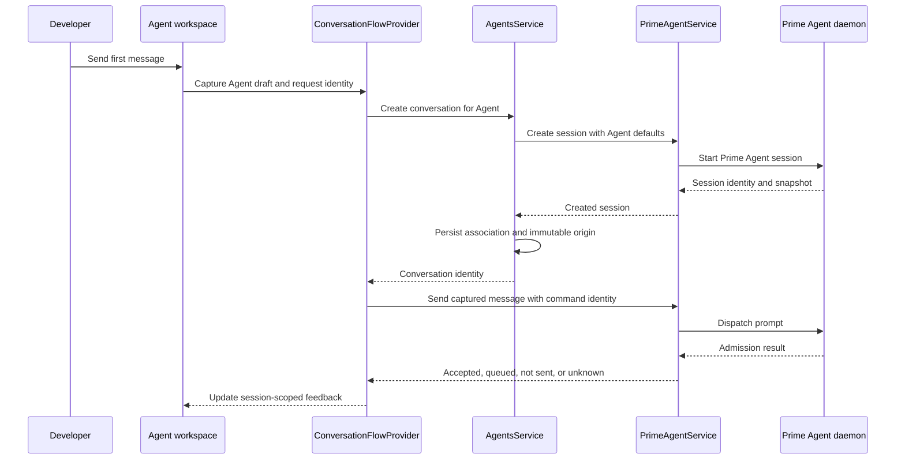
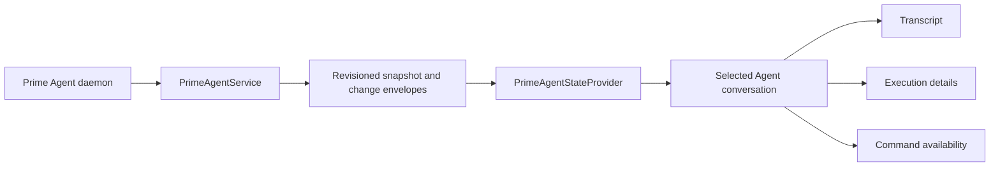
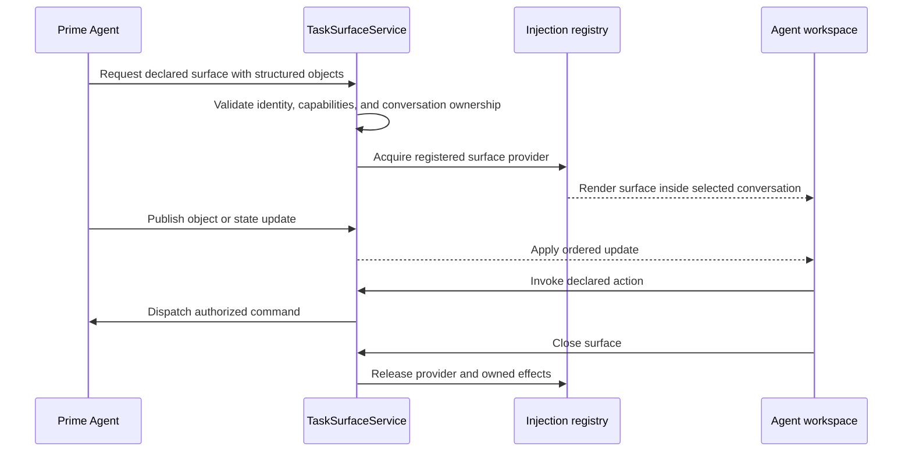

# Ship an Agent-first conversation interface

This specification defines an Agent-first Ernie interface with the immediacy of a messaging app. It covers the visible experience and the backend path from the first message to Prime Agent execution, recovery, and conversation history.

## Outcome

A developer can open Ernie, choose a persistent Agent, send work, follow execution, and return later without reasoning about Prime Agent sessions.

The interface treats an Agent like a durable contact. Conversations are separate work records under that Agent. Prime Agent sessions remain the execution and transcript authority.

Success means a developer can complete these actions without learning the storage model:

1. Add an Agent with a role and default workspace
2. Open the Agent and start work from one focused composer
3. See whether Prime Agent accepted or queued the message
4. Follow streaming replies and execution details in the same conversation
5. Queue a follow-up or stop active work
6. Leave and return without losing the selected conversation or draft
7. Start a separate conversation with the same Agent
8. Recover from creation, sending, attachment, or connection failure

## Ernie's thesis

This interface is the stable shell for the product direction in [The best software is yet to be made](https://ta-0.com/blog/the-best-software-is-yet-to-be-made). The article argues that chat is a useful first shape, but it flattens files, worktrees, tests, sources, artifacts, and delegated work into one transcript.

Ernie should preserve two truths at once:

- Agents and conversations give people stable orientation
- the central workspace can follow the objects, capabilities, and lifetimes of the work

The Agent roster answers who owns the work. The conversation answers what happened. A task surface answers what the work has become. Zenbu supplies the application runtime that registers, renders, updates, and cleans up those surfaces.

```text
stable shell                         task-shaped workspace

Agent -> conversation -> messages -> files, diffs, tests, sources, artifacts
  |           |             |                       |
identity    work record    evidence             direct manipulation
```

The interface must not replace chat with constant rearrangement. The shell stays stable while declared surfaces appear inside the selected conversation. Each surface has a reason to exist, a bounded capability set, an owner, and a cleanup path.

## Product model

Use four names consistently:

| Product concept | Visible meaning | Owner |
| --- | --- | --- |
| Agent | A persistent role with identity and defaults | Ernie |
| Conversation | One work record with an Agent | Ernie through Zenbu, with the transcript from Prime Agent |
| Session | The execution behind a conversation | Prime Agent executes it; Ernie's Zenbu services attach and project it |
| Workspace | The directory where the session runs | Ernie stores the Agent default through Zenbu; Prime Agent owns each session's execution origin |

The main interface says **Agent** and **conversation**. Show **Prime Agent session** only in technical recovery details or diagnostics.

This specification implements the accepted ownership model in [ADR 0001](adr/0001-persistent-agent-product-model.md). The decision makes Agents durable identities, keeps several conversations under each Agent, and leaves execution and transcripts with Prime Agent. Ernie owns Agent records and their conversation associations. The decision also treats memory, routines, task surfaces, and coordination as later capabilities that need explicit contracts.

The interface preserves the state and command invariants in [data structures](data-structures.md).

### Zenbu's role

Zenbu is the host runtime between the product interface and Prime Agent. Ernie uses it to compose the application from plugins, run main-process services, persist Agent state, expose typed remote procedure calls, publish events, and render registered injections.

Use Zenbu for:

- Agent and conversation organization in the shared database
- services that translate product actions into Prime Agent commands
- typed events and state updates across processes
- plugin capability registration
- task-surface injection and rendering
- lifecycle cleanup for acquired resources

Prime Agent still owns session execution, transcript truth, command admission, and recovery. Zenbu owns how Ernie hosts and presents those capabilities.

## Interaction model

The interface borrows the useful structure of WhatsApp without copying its brand or visual language:

- contacts become Agents
- a chat becomes an Agent conversation
- the conversation list stays secondary to the selected Agent
- the transcript and composer remain in one stable place
- message delivery and execution state stay distinct
- narrow desktop windows preserve the same Agent and conversation hierarchy

The result should feel familiar because the interaction hierarchy is familiar. Ernie keeps its warm paper surfaces, orange action color, Gelica display type, and work-record transcript.

This familiar hierarchy creates the base layer for jellyware. It gives the developer a dependable place to return when a task surface appears, changes, or leaves.

```text
Ernie
├── Agent roster
│   ├── Search Agents
│   ├── Favorite Agents
│   ├── Remaining Agents
│   ├── Add Agent
│   └── Unassigned history
└── Selected Agent
    ├── Agent header
    │   ├── Identity and current conversation
    │   ├── Conversation history
    │   ├── New conversation
    │   └── Agent settings
    ├── Conversation
    │   ├── Empty introduction
    │   ├── Transcript
    │   ├── Execution details
    │   └── Recovery notices
    ├── Task workspace
    │   ├── Available surfaces
    │   ├── Active surface
    │   └── Surface lifecycle
    └── Composer
        ├── Draft
        ├── Model and effort
        └── Send, queue, check, or stop
```

## Desktop layout

Use two permanent regions:

1. The Agent roster uses a compact left column
2. The selected Agent uses the remaining width for its conversation

Keep the transcript near 70 characters per line. Let the surrounding workspace absorb extra width. Do not add a permanent third column until artifacts or task surfaces have a complete product contract.

The Agent header contains:

- Agent avatar, name, and role
- current conversation title
- workspace name, with the full path available in conversation options
- **New conversation**
- **Conversation history**
- **Agent settings**

The header does not display an Ernie title bar. The roster already establishes application identity.

## Platform support

This specification targets the Ernie desktop application. Mobile is not supported yet.

Narrow desktop windows must preserve the selected Agent, transcript, and composer without document overflow. They do not need a separate mobile navigation model.

## Agent roster

Each row contains:

- avatar
- Agent name
- one preview line
- favorite action on hover, keyboard focus, or touch

Choose the preview from authoritative data in this order:

1. aggregated active or recovery state
2. most recently visited conversation title
3. Agent role
4. `Start a conversation`

Activity does not reorder rows. Favorite Agents precede the remaining Agents. Creation order stays stable inside each group.

### Empty roster

The empty roster must explain the first useful action:

- heading: `Add an Agent to begin`
- body: `Give each Agent a role and workspace, then start a conversation.`
- primary action: `Add Agent`

Selecting **Add Agent** opens the existing settings form. Preserve entered values when creation fails.

The unselected workspace starts with `your next idea, meet your Agent.` and the existing character illustrations. Its primary action opens the same settings form. Use left-aligned display typography and reserve illustration for empty states.

### Empty Agent search

Search emptiness is a result state, not onboarding:

- heading: `No Agents match “{query}”`
- action: `Clear search`

Return keyboard focus to the search field after clearing it.

### Unassigned history

Keep imported or unassigned sessions under **History**. When none exist, show `No unassigned conversations.` Do not give this state onboarding prominence.

## Selected Agent without a conversation

This is the main first-use empty state. It should introduce the Agent and make composition feel like the obvious next action.

Show:

- the Agent avatar
- heading: `what’s next, {agentName}?`
- the Agent role when available
- workspace: `Starts in {workspaceName}`
- the shared composer with focus

Do not show generic instructions below the composer. The heading, role, workspace, placeholder, and action already explain the state.

Composer placeholder: `Message {agentName}`

The first send creates a conversation and submits the captured message. Keep one visible composer throughout creation. Do not replace it with a loading screen.

### First-send states

| State | Composer | Feedback |
| --- | --- | --- |
| Ready | Editable and focused | None |
| Creating | Editable for later text | `Starting conversation…` |
| Attaching | Editable with session-owned draft | `Opening conversation… You can keep writing.` |
| Sending | Editable for later text | `Sending message…` |
| Accepted | Clear only the submitted draft | `Sent` may appear briefly |
| Queued | Clear only the submitted draft | `Queued after the current work` |
| Creation failed | Preserve the draft | Explain that no conversation started and offer retry |
| Send failed before dispatch | Preserve the draft | Explain that the message was not sent and offer retry |
| Send outcome unknown | Preserve recovery identity | Show **Check send** and duplication guidance |

## New conversation

**New conversation** creates and opens a draft Prime Agent session under the selected Agent. It does not copy messages from the previous conversation.

Use the same empty introduction and composer as an Agent without conversations. The Agent's current instructions, workspace, provider, and model defaults apply when Ernie creates the draft session. The first message submits to that existing session.

After creation, the introduction uses the session's actual workspace, not later Agent defaults. Native creation names the session `New conversation`.

The draft survives Agent and conversation navigation for the application lifetime. A browser reload may clear it.

## Conversation history

Open history as a compact panel from the Agent header. Each row contains:

- conversation title
- workspace name
- current activity when active
- last visited time when idle and available

The first implementation may omit time because the current model stores visit order, not a complete message timestamp contract.

Sort conversations by explicit visit recency. Runtime activity does not move a conversation.

### Empty conversation history

Show `No conversations yet.` Keep **New conversation** available in the same panel.

## Active conversation

Keep the selected conversation stable while messages stream. The interface contains:

- readable transcript entries
- a session-level execution disclosure
- connection or command notices above the transcript
- the shared composer at the bottom

User and assistant messages use work-record spacing instead of speech bubbles. Execution output can use compact cards or disclosures, but it must stay attached to the conversation.

The send action changes with authoritative state:

| Runtime state | Available actions | Behavior |
| --- | --- | --- |
| Idle | Send | Submit a prompt |
| Working with text | Queue and Stop | Add a follow-up or request stop |
| Working without text | Stop | Request stop; keep Queue disabled |
| Send outcome unknown | Check send | Inspect the original receipt without dispatching again |
| Reconnecting or recovering | Disabled send | Preserve the draft until commands return |
| Failed transport | Disabled send | Preserve the draft and explain the consequence |

Keep an explicit stop action available while text is present. Queuing a follow-up and stopping work are separate intentions.

## Task-shaped workspace

The transcript remains the durable work record. When Prime Agent produces structured objects, the conversation may expose a surface that lets the developer inspect or act on those objects directly.

Use task objects, not job categories, to select a surface:

| Observed objects | Candidate surface | Supported actions |
| --- | --- | --- |
| Worktree, changed files, diff, checks | Code change | Inspect diff, open file, run declared check, review result |
| Sources, notes, dataset, chart | Research | Inspect sources, compare evidence, open dataset, review chart |
| Document, revisions, comments | Document | Read, edit, compare revisions, resolve comments |
| Browser target, captures, findings | Browser review | Inspect page, navigate, capture evidence, record finding |
| Child agents, assignments, results | Delegation | Inspect branches, compare status, open child evidence |

The first task surface should target coding work because Ernie already knows repositories, worktrees, sessions, tool activity, and checks. Zenbu plugins and injections should provide the surface modules. The surface should compose existing evidence before it introduces new execution powers.

### Composition rules

A task surface can appear only when all required capabilities are available. Its declaration includes:

- a stable surface type and instance identity
- the conversation and Agent that own it
- the structured objects it presents
- the capabilities it requires
- the commands it can invoke
- the reason it became relevant
- its lifetime and cleanup operation
- a transcript fallback for unsupported hosts

The host chooses the allowed surface vocabulary. Prime Agent can request or populate a declared surface. It cannot generate arbitrary application code, change global chrome, or receive broader authority through presentation.

### Presentation rules

- keep the Agent roster, header, and composer stable
- open one primary task surface beside or in place of the transcript
- keep the transcript reachable with one action
- preserve the selected Agent and conversation during composition
- show why a surface appeared when the reason is not obvious
- let the developer close a temporary surface without ending the conversation
- retain durable artifacts after their temporary surface leaves
- restore focus predictably when a surface opens or closes

At narrow desktop widths, the transcript and task surface become sibling views inside the selected conversation. They do not compress into unusable columns.

## Supporting empty states

Supporting surfaces use compact result states. They do not compete with the selected Agent empty state.

| Surface | Empty copy | Action |
| --- | --- | --- |
| Workspace picker | `No workspaces yet` | `Start a conversation to add its workspace.` |
| Workspace search | `No workspaces match “{query}”` | **Clear search** |
| Model search | `No models match “{query}”` | **Clear search** |
| Tool text output | `No text output is available.` | None |
| Session opening | `Unable to open this conversation` | **Try again** |

Search result states announce their result count through `role="status"`. Retry errors use `role="alert"` and move focus only when the action cannot continue otherwise.

## End-to-end backend flow

The UI uses the existing Agent and Prime Agent boundaries. It must not create a second transcript, execution state, or selected-session authority.



After admission, synchronization follows one authoritative path:



### Backend responsibilities

`AgentsService` and `AgentStoreService` own:

- Agent identity and settings
- favorite state
- Agent-to-session associations
- conversation visit recency
- immutable creation origin
- serialized and verified Zenbu persistence

`PrimeAgentService` owns:

- session catalog and selection
- session creation and attachment
- authoritative snapshots and ordered changes
- model, effort, stop, and send commands
- send receipt identity and recovery
- reconnection and attachment recovery

`ConversationFlowProvider` owns:

- application-lifetime creation and submission feedback
- first-message coordination
- immutable send requests
- uncertain-send recovery
- session-scoped stop feedback

`ConversationDraftProvider` owns:

- unsent drafts keyed by Agent or session
- transfer from an empty Agent to a created session
- preservation of edits made after a send begins

The renderer derives labels and command availability from these owners. It does not infer completion from an idle state, animation, or elapsed time.

### Task-surface backend boundary

The Agent-first interface can ship on current contracts. Jellyware composition needs an additional host-owned contract rather than component-local state.



`TaskSurfaceService` is a target boundary, not implemented behavior. Its contract must own:

- surface identity and conversation ownership
- provider registration and capability matching
- ordered structured updates
- action validation and dispatch
- acquisition failure and recovery
- release, process cleanup, and native resource cleanup

Zenbu injections can supply registered React surfaces. Service lifecycle cleanup can release their owned effects. Neither mechanism alone defines task-object identity, action authority, or durable artifact ownership.

## Contract changes

The first interface iteration should use existing contracts. Add data only when the visible behavior requires it.

Potential later additions require separate contract work:

| Capability | Missing contract |
| --- | --- |
| Last-message time | stable message or conversation timestamp |
| Unread marker | durable read cursor and update rules |
| Attention state | authoritative runtime reason and acknowledgement |
| Cross-conversation Agent memory | persistence, scope, retention, and sharing rules |
| Routines | schedule, admission, cancellation, recovery, and authority |
| Task surfaces | identity, capability requirements, object updates, actions, and cleanup |
| Artifacts | durable identity, storage, provenance, and conversation association |

Do not simulate these capabilities in presentation state.

## Component plan

Keep the current ownership boundaries and refine these production components:

```text
src/renderer/components/
├── sidebar.tsx                    # Agent roster and unassigned history
├── agent-workspace.tsx            # Agent header and conversation history
├── empty-conversation.tsx         # Main Agent introduction
├── chat-workspace.tsx             # State selection and notices
├── conversation-transcript.tsx    # Work-record transcript
├── conversation-activity.tsx      # Runtime execution details
├── prime-composer.tsx             # Send, queue, check, and stop
├── model-picker.tsx               # Model result states
└── workspace-picker.tsx           # Workspace result states
```

Consolidate empty-state presentation only when two surfaces share hierarchy and interaction. Keep search results compact. Keep the main Agent introduction expressive.

## Delivery slices

Deliver the interface in five coherent slices. The first four ship on current contracts; the fifth begins after the task-surface contract exists.

### Slice 1: Agent-first shell

- refine roster hierarchy, rows, and first-run state
- make Agent selection open the latest conversation or empty introduction
- preserve Agent and conversation navigation at narrow desktop widths
- preserve current backend behavior

Completion criterion: the Empty, Populated, Long names, and New Agent scenarios support selection, creation, and return navigation.

### Slice 2: Conversation home

- refine the Agent header and conversation-history panel
- unify the empty Agent and draft-conversation presentation
- keep one composer across empty, creating, sending, and failed states
- remove duplicate explanatory copy

Completion criterion: a first message creates one associated session, sends once, preserves later draft edits, and leaves recovery visible on failure.

### Slice 3: Live work

- refine transcript rhythm and execution disclosure
- make Send, Queue, Stop, and Check send distinct
- preserve scroll position and session continuity
- make transport and recovery consequences explicit

Completion criterion: active work, queued follow-up, stop, reconnection, failed connection, and uncertain send remain truthful during navigation.

### Slice 4: Result-state consistency

- align Agent, conversation, workspace, and model search results
- add clear-search actions where recovery is immediate
- verify focus restoration and status announcements
- inspect light, dark, reduced-motion, and forced-color modes

Completion criterion: every empty or no-result state explains what is empty and offers the next supported action.

### Slice 5: First task-shaped surface

- define the host-owned task-surface contract
- register one coding surface through the plugin injection boundary
- project worktree, changed-file, diff, and check evidence from structured runtime data
- keep commands explicit and capability-scoped
- release every process, subscription, and native resource when the surface leaves
- retain the transcript as the fallback and durable work record

Completion criterion: one coding conversation can open, update, close, and restore a task surface without losing conversation state or leaking owned effects.

## Acceptance scenarios

Use production components through `?browser=1&scenario=agents`. Extend the isolated scenario boundary only when an acceptance state cannot be reached safely.

Inspect these scenarios through browser hot module replacement:

1. Empty roster at standard and narrow desktop widths
2. Agent with no conversations
3. Draft conversation before its first message
4. First-message creation and attachment in progress, including later draft edits
5. Creation failure with the draft preserved
6. Send failure before dispatch
7. Unknown send with **Check send**
8. Active conversation with a queued follow-up
9. Reconnecting and failed transport
10. Agent and conversation switching with separate drafts
11. Empty Agent, workspace, and model searches, including filter reset with eight or fewer models
12. Keyboard-only creation, navigation, sending, and clearing

The later task-surface phase also requires coding surface acquisition, update, close, and restoration; missing-provider fallback; and cleanup after partial acquisition. These are not implemented by the conversation-home iteration.

For every scenario, record:

- viewport
- controlled or live data source
- actions used to reach the state
- expected visible result
- observed visible result
- remaining integration uncertainty

UI completion requires HMR inspection of the affected states. Browser scenarios do not establish Electron-specific or live-daemon behavior.

## Non-goals

This interface iteration does not add:

- WhatsApp branding, chat bubbles, or copied visual assets
- cross-conversation Agent memory
- unread counts
- inferred completion or attention badges
- background sending after application restart
- exactly-once delivery after a native acknowledgement is lost
- routines, scheduling, or autonomous coordination
- a task database
- arbitrary generated interface code
- task surfaces that change global application chrome
- a permanent artifact or task-surface column

These capabilities need explicit runtime and persistence contracts before the interface can promise them.
