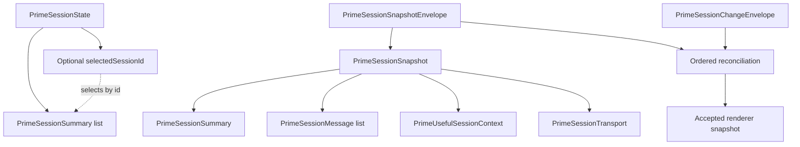

# Data structures

Use this guide when changing session data, synchronization, command payloads, or UI state lifetime. The [shared contracts](../src/packages/prime-agent/index.ts) define exact fields. This guide explains their relationships and invariants without maintaining a second schema.

## Current session model

Ernie separates the session catalog from the detailed snapshot of an attached session:

The catalog revision orders catalog and selection updates. Snapshot-envelope revisions order one attached session’s projected changes. They are separate revision streams and must not be compared with each other.

## Identity and state

The current types keep identity, execution, and connection health separate:

| Structure | Meaning | Invariant |
| --- | --- | --- |
| `PrimeSessionSummary` | Session identity, workspace, name, lifecycle, execution state, and optional model | Use `id` for identity; names and paths are not unique identifiers |
| `PrimeSessionState` | Catalog and optional selected session at one revision | Apply selection and catalog from the same accepted state |
| `PrimeSessionSnapshot` | Session summary, readable transcript, useful context, and transport | Render related session information from one accepted snapshot |
| `PrimeSessionMessage` | Identified transcript entry with role and text | A change can update an existing message by `id` |
| `PrimeUsefulSessionContext` | Structured messages, runtime details, family relationships, and replay position | Treat optional context as unavailable when absent |
| `PrimeSessionTransport` | Connected, reconnecting, or failed connection | A failed connection requires error information; it does not prove execution failed |

Lifecycle distinguishes `archived`, `draft`, and `live`. Execution state distinguishes `idle`, `working`, and `recovering`. Neither field substitutes for transport health. An archived lifecycle in the contract does not imply an archive control exists in the UI.

Structured and readable messages serve different consumers. Keep their projections aligned through the runtime boundary. Do not create an independent transcript authority in a component.

## Ordered synchronization

Snapshot and change envelopes carry `sessionId`, `generation`, and `revision`. The [synchronization module](../src/packages/prime-agent/sync.ts) parses these values and owns reconciliation.

Apply changes only to the matching session and generation at the next expected revision. Ignore already-applied revisions. Recover with a fresh snapshot when continuity cannot be established. An envelope’s session identifier must match its snapshot’s session identifier.

See the [runtime map](../lat.md/runtime.md#ordered-synchronization) for generation changes, revision gaps, and buffering limits. Keep these rules at the synchronization boundary rather than reimplementing them in UI components.

## Commands and admission

Command payloads identify the session independently of the currently selected UI:

| Contract | Purpose |
| --- | --- |
| `CreateSessionRequest` | Workspace and optional name for a new session |
| `AttachSessionRequest` | Session identity for attachment |
| `PromptRequest` | Session, admission identifier, command identifier, and submitted content |
| `PromptAdmission` | Confirmation that Prime Agent owns the submitted turn |
| `SessionTextAction` | Session-scoped text for a follow-up |
| `SessionAction` | Session-scoped operation such as stop or wait-for-idle |

[Chat-session coordination](../src/packages/chat-session/index.ts) owns pending prompt admission. Submission, admission, and completed execution are different outcomes. Keep their identifiers and visible feedback distinct.

## Lifetime and persistence

The [architecture guide](architecture.md#ownership) defines ownership across the runtime and renderer. Readonly TypeScript data does not itself define persistence or survival across remounts.

Before adding a value, establish its identity, owner, update source, and lifetime. Specify whether it survives session switching, component unmount, application restart, or reconnection. Derive values from existing state when they need no independent lifetime.

For a boundary change, update its TypeScript contract, parser, producer, consumer, and relevant fixture together. Check the affected integration boundary when verification is authorized. Keep JSON-safe projections explicit at process boundaries.

## Future Agent records

[ADR 0001](adr/0001-persistent-agent-product-model.md) defines an Agent with persistent identity and several conversations. Initially, each conversation corresponds to one Prime Agent session. This is an accepted product direction, not a current storage schema.

Agent storage, existing-session association, and presence across concurrent sessions remain implementation decisions. Define those decisions before adding persisted records. Keep Agent identity separate from session execution and workspace location.

## Keeping this guide current

Update this guide when a relationship or invariant changes. Keep exact field declarations in source, ownership in [architecture](architecture.md), and visible behavior in [UI guidance](ui.md). Link durable discoveries through the [domain map](../lat.md/domain.md).
