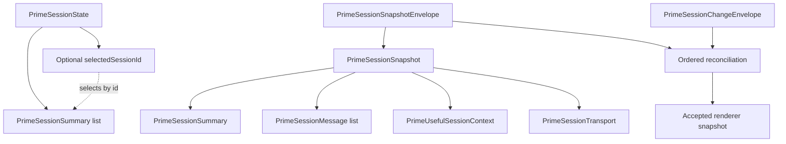

# Data structures

Use this guide when changing session data, synchronization, command payloads, or UI state lifetime. The [shared contracts](../src/packages/prime-agent/index.ts) define exact fields. This guide explains their relationships and invariants without maintaining a second schema.

## Current session model

Ernie separates the session catalog from the detailed snapshot of an attached session:

The catalog revision orders catalog and selection updates. Snapshot-envelope revisions order one attached session’s projected changes. They are separate revision streams and must not be compared with each other.

## Identity and state

The current types keep identity, execution, and connection health separate:

| Structure | Meaning | Invariant |
| --- | --- | --- |
| `PrimeSessionSummary` | Session identity, workspace, name, lifecycle, execution state, and optional model | Use `id` for identity; names and paths are not unique identifiers |
| `PrimeSessionState` | Catalog and optional selected session at one revision | Apply selection and catalog from the same accepted state |
| `PrimeSessionSnapshot` | Session summary, readable transcript, useful context, and transport | Render related session information from one accepted snapshot |
| `PrimeSessionMessage` | Identified transcript entry with role and text | A change can update an existing message by `id` |
| `PrimeUsefulSessionContext` | Structured messages, runtime details, family relationships, and replay position | Treat optional context as unavailable when absent |
| `PrimeSessionTransport` | Connected, reconnecting, or failed connection | A failed connection requires error information; it does not prove execution failed |

Lifecycle distinguishes `archived`, `draft`, and `live`. Execution state distinguishes `idle`, `working`, and `recovering`. Neither field substitutes for transport health. An archived lifecycle in the contract does not imply an archive control exists in the UI.

Structured and readable messages serve different consumers. Keep their projections aligned through the runtime boundary. Do not create an independent transcript authority in a component.

## Ordered synchronization

Snapshot and change envelopes carry `sessionId`, `generation`, and `revision`. The [synchronization module](../src/packages/prime-agent/sync.ts) parses these values and owns reconciliation.

Apply changes only to the matching session and generation at the next expected revision. Ignore already-applied revisions. Recover with a fresh snapshot when continuity cannot be established. An envelope’s session identifier must match its snapshot’s session identifier.

See the [runtime map](../lat.md/runtime.md#ordered-synchronization) for generation changes, revision gaps, and buffering limits. Keep these rules at the synchronization boundary rather than reimplementing them in UI components.

## Commands and admission

Command payloads identify the session independently of the currently selected UI:

| Contract | Purpose |
| --- | --- |
| `CreateSessionRequest` | Workspace and optional name for a new session |
| `AttachSessionRequest` | Session identity for attachment |
| `SendRequest` | Service epoch, command identity, session, immutable content, and prompt or follow-up mode |
| `SendReceipt` | Accepted, queued, definitely not sent, or unknown delivery outcome |
| `SessionAction` | Session-scoped operation such as stop or wait-for-idle |

[Chat-session coordination](../src/packages/chat-session/index.ts) owns pending prompt admission. Submission, admission, and completed execution are different outcomes. Keep their identifiers and visible feedback distinct.

## Lifetime and persistence

The [architecture guide](architecture.md#ownership) defines ownership across the runtime and renderer. Readonly TypeScript data does not itself define persistence or survival across remounts.

Before adding a value, establish its identity, owner, update source, and lifetime. Specify whether it survives session switching, component unmount, application restart, or reconnection. Derive values from existing state when they need no independent lifetime.

For a boundary change, update its TypeScript contract, parser, producer, consumer, and relevant fixture together. Check the affected integration boundary when verification is authorized. Keep JSON-safe projections explicit at process boundaries.

## Persistent Agent records

[Agent contracts](../src/packages/agents/index.ts) define Effect schemas for the Zenbu roster. Agent UUIDs remain stable across name and workspace changes. Settings revisions reject stale edits; instruction revisions advance only when instructions change. Favorites use the persisted `pinned` field without changing creation order.

An avatar is an original character identifier or a generated recipe with `kind: "generated"` and a natural-number seed. The renderer derives appearance from that seed without storing SVG. Retry comparison uses value equality so a recipe that crosses RPC remains the same setting. Existing character identifiers retain their original appearance.

An Agent’s optional `root` stores its persisted native session ID and file. `prepared` means that identity was saved before activation; `bound` means native activation was acknowledged. An absent root is an unbound or legacy profile. Runtime availability is derived from attachment and catalog state, not persisted as a competing status.

Preparation materializes one native session in a directory keyed by a hash of the Agent ID beside the profile database. Activation opens that exact file. Retry after an uncertain native response reuses the prepared identity. The native lease prevents a second resident runtime for that file. A missing bound file reports an error and is never replaced.

Associations retain legacy session membership and immutable creation origins: Agent ID, instruction revision, instruction text, working directory, and provider/model defaults. They no longer define which session normal Agent navigation opens. One legacy session may bind directly; several require an explicit choice. The other sessions remain inspectable through Saved sessions. Bound roots cannot be reassigned, and imports cannot duplicate a native root across profiles.

Native names drive the sidebar and header. Rename calls the native boundary, preserves collision checks, and detects a stale native name when the editor provides its expected value. Avatar and favorites remain Ernie metadata. Instructions and folder are fixed after preparation; model controls remain native. A legacy session without an origin resumes without fabricated configuration.

The catalog includes native RLM depth where supplied. The detailed family projection carries child IDs, current active targets, parent references, and `childrenAvailable`. An unsupported roster is distinct from an empty list. Inspection validates both the parent’s durable ID and child registry ID against the attached child snapshot. Child completion and explicit reply receipt are separate fields.

## Conversation interaction lifetime

Submission feedback distinguishes idle, creating, sending, accepted, queued, unknown, and error states. Stop feedback has its own idle, stopping, and error states. Both remain session-keyed outside mounted workspace components. An empty Agent initially uses its Agent draft key; creation associates subsequent submission feedback with the returned session ID.

The Agent's creating state remains visible if native selection arrives before the creation response. After draft transfer, the session owns sending feedback. Attachment does not remove its composer; commands remain unavailable until the authoritative snapshot permits them.

Runtime admission and queued follow-up acknowledgement are separate outcomes. The send receipt preserves one command identity across prompt and follow-up recovery; acknowledgement does not establish that the instruction has executed. No new task or unread record is persisted.

Reading positions store a scroll offset and whether the reader was at the end, keyed by session for the application lifetime. Tool-output presentation accepts the native `toolResult` shape and only supported text content, preserving the tool error flag without interpreting it as overall task completion.

## Send receipts and recovery

The chat coordinator reserves a command ID and the service epoch before calling `sendMessage`. It retains the original session, content, and mode until delivery is confirmed or the user explicitly releases uncertainty. Concurrent callers share one pending result. Recovery uses the original request even if the draft changes or the session starts working.

`PrimeAgentService` parses the request and reserves its receipt before native dispatch. Repeated IDs share the same pending or completed result. A changed payload with the same ID returns unknown. Preparation failures return not-sent; a subsequent user retry can create a new identity because no message entered native dispatch. Errors after dispatch starts return unknown and never trigger automatic redelivery.

A lost renderer RPC response can recover a completed receipt through Check send. This action calls `checkSend`, which never attaches to the daemon or dispatches a message. If no receipt exists, the service records not-sent before responding; a delayed original request then receives that same outcome. Checking a receipt remains available while the daemon is disconnected. A lost native acknowledgement remains unknown: the installed Prime Agent admission IDs support cancellation, not durable deduplication or passive status lookup. Ernie does not infer admission from matching transcript text. The user can inspect the conversation and explicitly allow a new send, which may duplicate an earlier message.

Follow-ups inspect the native `queued` result. A false result means Prime Agent did not add another equivalent pending follow-up; Ernie retains the draft. Accepted and queued receipts describe admission, not eventual execution or successful completion.

Receipts belong to the main-service instance and are not durable. A random epoch prevents a surviving renderer request from being redelivered after that owner restarts. The ledger retains up to 10,000 identities and rejects new ones at capacity instead of evicting deduplication evidence. Settled entries retain a SHA-256 payload fingerprint and outcome, not message text. Renderer draft and unresolved-send identity still disappear on browser reload; no background outbox or crash-safe exactly-once guarantee exists.
