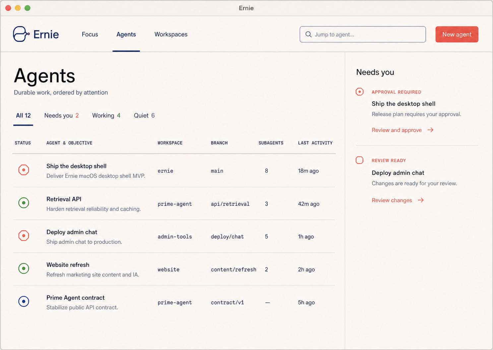

# Ernie design

Ernie is a calm desktop home for durable Prime Agent work. It uses the selected continuous-agent mark as its product identity.

## Product structure

- Agent is the primary object.
- Conversation belongs inside an Agent. It is not the global navigation model.
- Focused Agent content uses ordered renderer plugins.
- The built-in `ai-chat` plugin owns transcript and execution work.
- The built-in `subagents` plugin owns recursive delegated work.
- Attention contains only unresolved conditions that require user action.
- Workspace comes from local repository and worktree context.
- Search and filters expose complexity without keeping the full hierarchy open.

## Primary surface

The default surface is an Agent roster with one narrow Attention column. It does not show a persistent company, project, worktree, session, or subagent tree.

The roster shows stable Agent title, current Objective, Workspace, branch, Subagent count, and last activity. Technical metadata uses monospace type. Product language uses the system sans-serif typeface.

## Identity

The Ernie mark is one continuous path that branches, rejoins, and ends at a coral connector. It represents durable Agent identity across branching and restoration.

The source asset is `public/ernie-logo.png`.

## Visual system

| Token | Value | Use |
| --- | --- | --- |
| Canvas | `#fbf8f2` | Main background |
| Surface | `#fffdf8` | Inputs and dialogs |
| Ink | `#11192c` | Primary text |
| Navy | `#142e72` | Brand and selected state |
| Coral | `#ed6254` | Primary actions and required attention |
| Moss | `#3c8a43` | Working state |
| Line | `#dad7cf` | Structural dividers |

The interface uses flat color, precise one-pixel dividers, and modest radii. It does not use gradients, glass, glow, or nested card grids.

## Interaction model

- Search matches Agent title, Objective, Workspace, and branch.
- Filters project Agents by attention state.
- Attention actions return the user to the related Agent.
- New Agent creates a local roster item and selects it.
- React Grab ships with Ernie and can be disabled from the header.

## Renderer plugins

The shared plugin host owns focused Agent content. `AgentPluginViews` supplies
the current session through the typed `AgentPluginViewContext` contract.

AI Chat and Subagents contribute `agent` views. Browser contributes a `primary`
view. Registration order determines display order within each location.

## Responsive behavior

Wide windows show Workspace, branch, Subagent count, and activity. Narrow windows remove lower-priority technical columns before they reduce Agent title or Objective readability.
