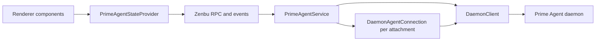

# Ernie integration

Ernie owns presentation and command coordination. Prime Agent owns execution and native session persistence. The [capability map](capabilities.md) distinguishes service support from visible UI controls.

## Ownership and transport

[PrimeAgentService](../../src/main/prime-agent/service.ts) owns the catalog, selection, shared client, attachment map, and recovery lifetime. It periodically refreshes the catalog in the main process. The renderer consumes revisioned projections rather than polling the daemon directly.

Each logical attachment owns its connection, subscription, snapshot, and cleanup. Connections use `closeClientOnDispose: false` because disposing one attachment must not close the shared client.

[AgentsService](../../src/main/services/agents.ts) and its store own presentation metadata and durable root bindings. [ADR 0002](../adr/0002-native-agent-roots.md) defines one native root per Ernie Agent; native runtime names, configuration, execution, and descendants remain upstream-owned.

## Endpoint lifecycle

[Development config](../../scripts/dev/config.ts) and packaged Ernie connect to the existing upstream user socket. Set `ERNIE_PRIME_AGENT_SOCKET` to select another socket. Ernie does not launch, install, or terminate a daemon. The Prime Agent client SDK remains a dependency.

[Handshake validation](../../src/main/prime-agent/daemon-client.ts) requires protocol and schema compatibility. External package versions can differ. Missing or incompatible endpoints report a connection failure and leave existing daemons untouched. Service disposal releases only Ernie's attachments and client.

## Identity and synchronization

A durable session ID, active runtime ID, and session-file path serve different purposes. Attachment resolves the active ID before accepting native snapshots. Concurrent callers share attachment acquisition.

Ernie projects native snapshots into its own generation/revision envelopes. These are separate from upstream event cursors. [Data structures](../data-structures.md) and the [runtime map](../../lat.md/runtime.md) own ordering and resynchronization details.

## Commands and recovery

The service supports catalog/selection, root preparation and activation, rename, attachment, child inspection, prompt/follow-up, abort, idle waiting, model selection, thinking effort, and recurrent depth. Existing service methods can outlive a product flow; their presence does not establish a visible control.

[Send receipts](../../src/main/prime-agent/send-receipts.ts) protect Ernie's renderer-to-service boundary with an epoch and immutable command identity. Follow-up checks the native `queued` result. Admission is separate from execution success.

The service receipt ledger is in-memory. Its `checkSend` path does not dispatch native work. Do not infer crash-safe exactly-once delivery from upstream journal support: this service does not explicitly enable `DaemonClient.enableRequestRecovery()`. See [receipt semantics](../data-structures.md#send-receipts-and-recovery).

On disconnect, Ernie retains the last snapshot and runs owned recovery before commands resume. Disposal cancels recovery and releases resources. [Integration tests](../../src/integration/prime-agent-daemon.integration.test.ts) cover logical isolation, external lifecycle, native resume, and service recovery; their existence is not a claim that a particular checkout passed them.
