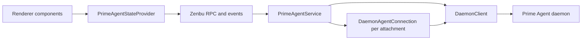

# Ernie integration

Ernie owns presentation and command coordination. Prime Agent owns execution and native session persistence. The [capability map](capabilities.md) distinguishes service support from visible UI controls.

## Ownership and transport

[PrimeAgentService](../../src/main/prime-agent/service.ts) owns the catalog, selection, shared client, attachment map, and recovery lifetime. It periodically refreshes the catalog in the main process. The renderer consumes revisioned projections rather than polling the daemon directly.

Each logical attachment owns its connection, subscription, snapshot, and cleanup. Connections use `closeClientOnDispose: false` because disposing one attachment must not close the shared client.

[AgentsService](../../src/main/services/agents.ts) and its store own presentation metadata and durable root bindings. [ADR 0002](../adr/0002-native-agent-roots.md) defines one native root per Ernie Agent; native runtime names, configuration, execution, and descendants remain upstream-owned.

## Endpoint lifecycle

[Development config](../../scripts/dev/config.ts) and packaged Ernie connect to the existing upstream user socket. Set `ERNIE_PRIME_AGENT_SOCKET` to select another socket. Ernie connects first. An absent endpoint permits starting the already installed executable; an accepting endpoint without a greeting does not. Set `ERNIE_PRIME_AGENT_START_DAEMON=0` to keep an endpoint connect-only. Installation and upgrades remain user actions. The Prime Agent client SDK remains a dependency, but is excluded from automatic executable discovery.

[Handshake validation](../../src/main/prime-agent/daemon-client.ts) requires protocol and schema compatibility. External package versions can differ. Incompatible greetings stop recovery immediately and leave existing daemons untouched. Service disposal releases only Ernie’s attachments and client.

[Installed daemon startup](../../src/main/prime-agent/installed-daemon.ts) searches absolute PATH entries and common GUI bin directories. `ERNIE_PRIME_AGENT_EXECUTABLE` selects an absolute executable without fallback. A three-second `--version` probe requires 0.9.3 or newer before launching `--mode daemon --daemon-socket`. Ernie removes inherited internal daemon-role and Electron/Node injection variables. The upstream socket lease and supervisor ownership registry arbitrate competing launches.

Ernie deliberately avoids upstream `ensureInteractiveDaemonRunning`, which can shut down an idle daemon with an older version. Startup readiness waits at most 30 seconds; failed probes never kill the launched process. The service retains a live child reference to avoid relaunching it on retries.

## Identity and synchronization

A durable session ID, active runtime ID, and session-file path serve different purposes. Attachment resolves the active ID before accepting native snapshots. Concurrent callers share attachment acquisition.

Ernie projects native snapshots into its own generation/revision envelopes. These are separate from upstream event cursors. [Data structures](../data-structures.md) and the [runtime map](../../lat.md/runtime.md) own ordering and resynchronization details.

## Commands and recovery

The service supports catalog/selection, root preparation and activation, rename, attachment, child inspection, prompt/follow-up, abort, idle waiting, model selection, thinking effort, and recurrent depth. Existing service methods can outlive a product flow; their presence does not establish a visible control.

[Send receipts](../../src/main/prime-agent/send-receipts.ts) protect Ernie's renderer-to-service boundary with an epoch and immutable command identity. Follow-up checks the native `queued` result. Admission is separate from execution success.

The service receipt ledger is in-memory. Its `checkSend` path does not dispatch native work. Do not infer crash-safe exactly-once delivery from upstream journal support: this service does not explicitly enable `DaemonClient.enableRequestRecovery()`. See [receipt semantics](../data-structures.md#send-receipts-and-recovery).

On disconnect, Ernie retains the last snapshot and tries recovery up to three times. A missing installation or incompatible greeting stops immediately. Explicit retry grants a fresh budget, and catalog polling pauses while disconnected. Disposal cancels recovery and releases resources. [Integration tests](../../src/integration/prime-agent-daemon.integration.test.ts) cover logical isolation, external lifecycle, native resume, and service recovery; their existence is not a claim that a particular checkout passed them.

## Effort and RLM max depth

Model catalog entries expose `supportedEfforts` from the installed native capability helper, including provider-specific differences. The attached snapshot exposes `useful.state.availableThinkingLevels` and `thinkingLevel`; unsupported effort requests follow Prime Agent's native clamping behavior.

Draft Agent settings accept optional `thinkingLevel` and `rlmMaxDepth`. Initial effort uses native `config.thinking`. Native creation config has no depth field, so prepared-root activation applies `setRlmMaxDepth` before returning the bound root. Reopening a bound root does not reapply either draft choice.

Depth accepts nonnegative safe integers, with zero disabling child delegation. Native precedence is chat, inherited, global, environment, then default 2. Ernie omits the setter's `global` option. Native `setThinkingLevel`, however, persists the session level and also updates Prime Agent's default thinking setting. Neither control is a per-message override.
