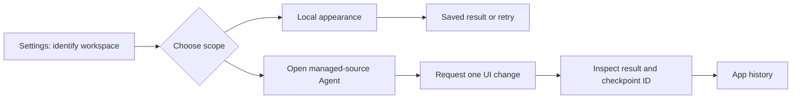

# Discover and verify scoped Ernie changes

Improve the Settings journey for people and Prime Agent without adding a second state owner. Start from source commit e45a31e7b57ad1fd05e3334e71f16ef5c59d0276 in this isolated worktree.

## Current boundaries

Appearance controls apply document styles and persist preferences in local storage. Settings already has accessible selectors, but successful writes have no explicit result and failed writes suggest reselecting an unchanged value. AppHistoryService.customize already resolves the managed source and opens a dedicated native root. Its entry point is absent from Settings.

## Implementation

1. Describe the selected conversation workspace and current page using existing navigation and roster state.
2. Explain local preference scope, announce actual save outcomes, and provide an explicit retry for unsuccessful writes.
3. Expose the existing customization service through a separate Settings disclosure with pending, unavailable, and retry feedback. Opening it must not send an editing prompt.
4. Document the source-edit journey and its evidence limits. Use existing history IDs and commands.

## Dependencies and verification

The theme task owns queued native screenshots, operation/checkpoint linkage, checkpoint naming, restore routing, and show-me presentation. Do not edit those implementations. Its supplied plan at /Users/thor/.codex/worktrees/1b3b/ernie/plans/native-ui-screenshot-checkpoints.md was absent during initial inspection. This task consumes the existing customization service and links to App history; native image evidence remains a dependency.

Use browser HMR when this worktree can run. Run authorized static checks and lat check. Automated tests, builds, and Electron launch/restart remain opt-in. Report source inspection separately from live journey evidence.

## Research

[Is Agentic methodology](https://is-agentic.com/methodology) evaluates observed public website behavior. Its [developer docs](https://is-agentic.com/docs) make unavailable capabilities and error recovery explicit. Apply those principles locally; a website score cannot establish native app or Prime Agent success. No scan is part of this work.

## Outcome and remaining evidence

Implemented the Settings disclosure, page and scope identifiers, selected Agent/root identifiers, successful preference feedback, and explicit persistence retry. Reused AppHistoryService.customize and AgentStateProvider.execute. No daemon, history controller, capture, restore, composer, or roster design implementation changed.

Nub dependency installation and Zenbu linking succeeded. Type checking and package boundary checks passed. Outline and StyleX checks found pre-existing violations in unchanged files. Standalone Vite on port 4397 returned the renderer, but ZenbuProvider withheld its children pending a service connection. The available service on port 4327 belongs to another worktree. Settings interactions and the native Prime Agent journey remain unverified; no Electron host, automated test, or build was launched.

